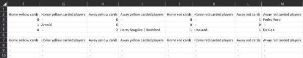

33

**FootballLeague Simulation**

**Table of contents**

1. [Introduction](#_page0_x72.00_y406.94)
1. [The simulation assumptions](#_page0_x72.00_y560.24)
1. [Workflow of the program](#_page1_x72.00_y437.55)
1. [Utils classes](#_page11_x72.00_y72.00)
1. [Design](#_page15_x72.00_y72.00)
1. [System Entities](#_page15_x72.00_y539.67)
1. [Challenging problems and how we solved it](#_page28_x72.00_y72.00)
1. [Testing](#_page32_x72.00_y72.00)
1. [Conclusion](#_page33_x72.00_y440.82)

**Introduction**

The program is a simulation for a footballleague.The program starts byentering the data of the participating clubs.Then the program allows the user to enter the gameweeks results. The program provides some statisticalfacts about the league,such as:the standings table and the best participating players.

**The simulation assumptions**

The simulation assumes some conditions that doesn’t exist exactlythe same wayin the real-world footballleagues.

1. **Players positions**

There are only3 positions the player can have:Goalkeeper,Defender,Striker.

2. **Numberof players in the team**

The team consists of 6 players:3 main players (goalkeeper,defender,striker)and 3 substitutes.

3. **When does the main playerget substituted?**

The main player onlygets substituted if he is banned from playing the match.

4. **How can the playerbe bannedfrom playing the match?**

The player can be banned from playing the next match in **2 cases**:

1. If he got a red card in his last match.
1. If he got a yellow card in each of his last 2 matches.

**5. Goals scoring**

The program assumes that the striker is the onlyplayer who scores goals.

**Workflow of the program**

The program has 2 stages:

1. Entering the required data for the league.
1. Showing the league dashboard.

**Stage 1:Entering the requireddata forthe league**

1. Enter number of the participated clubs in the league

2. Enter clubs names

3. Enter the manager and players’names of each club

**Stage 2:Showing the league dashboard**

The dashboard main menu allows the user to:

1. Go to the Gameweeks menu.
1. Print the Standings table.
1. Go to the Statistics menu.
1. Go to the Clubs info menu.
1. Go to the Players info menu.
1. Press 0 to close the program.
1. **Gameweeks Menu**

The gameweeks menu allows the user to:

1. Print the gameweeks table in a csvfile.

/sheets/gameweeks.csv

2. Enter the results of the current gameweekmatches.

3. Print the details of the current gameweekmatches.

After entering the results of Gameweek#1 matches,Let’s create the gameweeks.csvfile again.

2. **Standings Table Menu**

Prints the standings table in a csvfile.The clubs are sorted depending on their points and goals difference.

/sheets/standings.csv

3. **Statistics Menu**

The statistics menu allows the user to:

a.Print best goalkeepers based on their clean sheets and the goals scored against them.

b.Print best defenders based on their clean sheets. c.Print best strikers based on their scored goals. d.Print top carded player.

4. **Clubs Info Menu**

The clubs menu allows the user to: a.Print the clubs’squad in a csvfile.

/sheets/clubs.csv

b.Search for a club byname or id.

5. **Players Info Menu**

The clubs menu allows the user to: a.Print the players data in a csvfile.

/sheets/players.csv

b.Search for a player byname or id.

**Utils Classes**

The program has 4 utilityclasses that perform tasks or operations that are not tied to anyspecific entityin the system.These classes are:

1. [Console](#_page11_x72.00_y254.72)
1. [Validator](#_page12_x72.00_y192.05)
1. [CSV](#_page13_x72.00_y72.00)
1. [Menu](#_page14_x72.00_y72.00)

**Util1:Console**

The class handles the operations related to the console,such as:the text color. **Methods**

|**Method**|**Description**|
| - | - |
|white()|Change the text color to white|
|success()|Change the text color to green|
|error()|Change the text color to red|
|**Method**|**Description**|
|clear()|Clear the terminal|
|sleep()|Sleep the program for 1 second|

**Util2:Validator**

The class validates the user input from the terminal. **Methods**

|**Method**|**Description**|
| - | - |
|readNum()|Checkthat the input has a numeric datatype|
|readPositiveNumOrZero()|Checkthat the input is a positive number or zero|
|readPositiveNum()|Checkthat the input is a positive number|
|readPositiveEvenNum()|Checkthat the input is a positive even number|
|readNumInRange()|Checkthat the input exists between the given range|
|readNonEmptyStr()|Checkthat the input is non-emptystring|

**Util3:CSV**

The class handles writing in csvfiles. **Attributes**

|**Attribute**|**Description**|
| - | - |
|filename|The csvfilename|
|file|An object of the ofstream class|

**Methods**

|**Method**|**Description**|
| - | - |
|addCell()|Write the given value in a new cell|
|newRow()|Create a new row|

**Util4:Menu**

The class handles the operations related to the program menus. **Methods**

|**Method**|**Description**|
| - | - |
|header()|Print the program header|
|main()|Print and handles the operations related to the main menu|
|gameweeks()|Print and handles the operations related to the gameweekmenu|
|standings()|Print and handles the operations related to the standings menu|
|statistics()|Print and handles the operations related to the statistics menu|
|clubs()|Print and handles the operations related to the clubs info menu|
|players()|Print and handles the operations related to the players info menu|
|footer()|Print the program footer and get the user backto the previous menu if he pressed 0|

**Design**

You can view the diagram in a better quality[here](https://drive.google.com/file/d/1LjjX3uUSxNP7MwhNVNmOEPbauGtM0zTX/view?usp=sharing)

**System entities**

1. [Manager](#_page16_x72.00_y190.53)
1. [Card](#_page16_x72.00_y524.50)
1. [Player](#_page17_x72.00_y350.56)
1. [Goalkeeper](#_page18_x72.00_y387.82)
1. [Defender](#_page19_x72.00_y192.05)
1. [Striker](#_page19_x72.00_y550.33)
1. [Formation](#_page20_x72.00_y221.91)
8. [Squad](#_page20_x72.00_y490.32)
8. [Club](#_page21_x72.00_y285.64)
8. [Match](#_page22_x72.00_y508.68)
8. [Gameweek](#_page24_x72.00_y570.64)
8. [League](#_page25_x72.00_y458.61)

**Entity 1:Manager**

**Attributes**

|**Attribute**|**Description**|
| - | - |
|name|Manager name|

**Methods**

|**Method**|**Description**|
| - | - |
|printDetails()|Print manager details|

**Entity 2:Card**

**Attributes**

|**Attribute**|**Description**|
| - | - |
|player\_id|Player id|
|club\_id|Player’s club id|
|match\_id|Match id|
|**Attribute**|**Description**|
|gameweek\_id|Gameweekid|
|is\_red|Checkif the card is red or not|

**Methods**

|**Method**|**Description**|
| - | - |
|isRed()|Checkif the card is red or not|

**Entity 3:Player**

**Attributes**

|**Attribute**|**Description**|
| - | - |
|id|Player id|
|club\_id|Player’s club id|
|name|Player’s name|
|position|Player’s position|
|is\_main\_player|The player’s role:main or substitute|
|cards\_count|Totalnumber of cards the player got|
|yellow\_cards\_count|Number of yellow cards the player got|
|red\_cards\_count|Number of red cards the player got|
|cards\_list|Arrayof cards that the player got|

|**Attribute**|**Description**|
| - | - |
|matches\_played|Number of matches which the player played|

**Methods**

|**Method**|**Description**|
| - | - |
|playNewMatch()|Increase the number of matches the player played by1|
|addCard()|Add a new card to the player’s cards\_list|
|checkCardColor()|Checks of the card is red or yellow|
|printDetails()|Print player’s details|

**Entity 4:Goalkeeper**

**Attributes**

|**Attribute**|**Description**|
| - | - |
|goals\_against|Number of goals scored against the goalkeeper|
|clean\_sheets\_num|Number of clean sheets|

**Methods**

|**Method**|**Description**|
| - | - |
|getCleansheetsNum()|Get the number of clean sheets|
|increaseCleansheets()|Increase number of clean sheets by1|
|**Method**|**Description**|
|addGoalsAgainst()|Increase number of received goals bythe given number|
|getGoalsAgainst()|Get the number of received goals|

**Entity 5:Defender**

**Attributes**

|**Attribute**|**Description**|
| - | - |
|clean\_sheets\_num|Number of clean sheets|

**Methods**

|**Method**|**Description**|
| - | - |
|getCleansheetsNum()|Get the number of clean sheets|
|increaseCleansheets()|Increase number of clean sheets by1|

**Entity 6:Striker**

**Attributes**

|**Attribute**|**Description**|
| - | - |
|goals\_scored|Number of goals the striker scored|

**Methods**

|**Method**|**Description**|
| - | - |
|scoreGoals()|Increase number of scored goals|
|getScoredGoals()|Get the number of scored goals|

**Entity 7:Formation**

**Attributes**

|**Attribute**|**Description**|
| - | - |
|goalkeeper|Pointer to the goalkeeper object|
|defender|Pointer to the defender object|
|striker|Pointer to the striker object|

**Entity 8:Squad**

**Attributes**

|**Attribute**|**Description**|
| - | - |
|club\_id:|The club id|
|mainPlayers|Formation of the main players|
|substitutes|Formation of the substitutes|

**Methods**

|**Method**|**Description**|
| - | - |
|getMainPlayers():|Get the main players|
|getSubstitutes()|Get the substitutes|
|setMainPlayers()|Sets main players|
|setSubstitutes()|Sets substitutes|

**Entity 9:Club**

**Attributes**

|**Attribute**|**Description**|
| - | - |
|id|Club’s id|
|name|Club’s name|
|points|Club’s points|
|wins|Number of times the club won|
|draws|Number of times the club draw|
|losses|Number of times the club lose|
|goals\_for|Club’s scored goals|
|goals\_against|Club’s received goals|
|manager|Club’s manager|
|squad|Club’s squad|
|players\_list:|List of club’s players|

**Methods**

|**Method**|**Description**|
| - | - |
|enterPlayers()|Enter club’players|
|enterManager()|Enter club’s manager|
|addGoalFor()|Increases number of club’scored goals|
|addGoalAgainst()|Increases number of club’s received goals|
|winMatch()|Increases Number of club’s points by3|
|drawMatch()|Increases number of club’s points by1|
|loseMatch()|Keep the number of club’s points without changing|
|getTotalCards()|Get totalnumber of cards the players have got|
|getTotalYellowCards()|Get totalnumber of yellow cards the players have got|
|getTotalRedCards()|Get totalnumber of red cards the players have got|
|printDetails()|Print club’s details|

**Entity 10:Match**

**Attributes**

|**Attribute**|**Description**|
| - | - |
|id|Match’s id|
|gameweek\_id|Gameweek’s id|
|home|Pointer to the home club|
|away|Pointer to the awayclub|

|is\_finished|Match status(finished or stilldidn’t start)|
| - | - |
|homeFormation|The home club formation for the match|
|awayFormation|The awayclub formation for the match|
|home\_goals|Home club goals|
|away\_goals|Awayclub goals|
|home\_cards\_num|Totalnumber of cards the home club got in the match|
|away\_cards\_num|Totalnumber of cards the awayclub got in the match|
|home\_yellow\_cards|Totalnumber of yellow cards the home club got in the match|
|away\_yellow\_cards|Totalnumber of yellow cards the awayclub got in the match|
|home\_red\_cards|Totalnumber of red cards the home club got in the match|
|away\_red\_cards|Totalnumber of red cards the awayclub got in the match|
|home\_cards\_list|List of cards the home club got in the match|
|away\_cards\_list|List of cards the awayclub got in the match|

**Methods**

|**Method**|**Description**|
| - | - |
|getValidPlayer()|Checkif the main player is valid for the match or if his substitute willplayinstead|
|pickTeamFormation()|Pickthe team formation for the match|
|printTeamFormation()|Prints the team formation|

|**Method**|**Description**|
| - | - |
|incPlayersMatchesCount()|Increase number of played\_matches for allthe participated players in the match|
|enterResult()|Enter the match result|
|updateGoalsStats()|
- Update the number of received goals bythe goalkeepers

- Update the number of scored goals bythe striker

- Update the number of clean sheets for the goalkeepers and defenders
|
|determineWinner()|Determine the winner team|
|enterCards()|Enter cards that the team has got|
|chooseCardColor()|Choose if the entered card is red or yellow|
|addCardToPlayer()|Add a new card to the player’s cards\_list|
|checkPlayerGotCard()|Checkif the player has alreadygot a card in the match|
|printPlayerInCardsMenu()|Print names of participated players in the match to choose who got a card|
|printDetails()|Print Match’s details|

**Entity 11:Gameweek**

**Attributes**

|**Attribute**|**Description**|
| - | - |
|id|Gameweekid|

|matches\_num|Totalnumber of matches in the gameweek|
| - | - |
|matches\_played|Number of matches that have finished (their results have been entered)|
|matches|List of matches in the gameweek|

**Methods**

|**Method**|**Description**|
| - | - |
|addMatch()|Add a new match to the matches list|
|enterMatchesResults()|Enter results of allmatches in the gameweek|
|printMatches()|Print details of allmatches in the gameweek|

**Entity 12:League**

**Attributes**

|**Attribute**|**Description**|
| - | - |
|clubs\_num|Totalnumber of participated clubs in the league|
|gameweeks\_num|Totalnumber of gameweeks in the league|
|current\_gameweek|Id of the current gameweek|
|matches\_num|Totalnumber of matches in league|
|matches\_played|Number of matches that have finished (their results have been entered)|

|matches\_num\_in\_gameweek|Totalnumber of matches in each gameweek|
| - | - |
|matches|List of allmatches in the league|
|clubs|List of allclubs in the league|
|gameweeks|List of allgameweeks in the league|
|players\_list|List of allplayers in league|

**Methods**

|**Method**|**Description**|
| - | - |
|enterClubsNames()|Enter clubs names|
|enterClubsDetails()|Enter clubs info (manager and squad)|
|assignPlayersList()|Add players to the players list|
|createMatchesSchedule()|Create the schedule of matches|
|enterCurrGameweekResults()|Enter matches results for the current gameweek|
|pickMatchesFormation()|Pickteams formations for the matches of the next gameweek|
|printGameweeksTable()|Print the gameweeks table in a csvfile|
|printClubsTable()|Print the clubs info in a csvfile|
|printPlayersTable()|Print the players info in a csvfile|
|printStandingsTable()|Print the standings table in a csvfile|
|searchForClub()|Search for a club|
|findClubIndex()|Find club indexbyname or id|
|searchForPlayer()|Search for a player|

|**Method**|**Description**|
| - | - |
|findPlayerIndex()|Find player indexbyname or id|
|sortClubsByPoints()|Sort the clubs list descendinglydepending on points and goals difference|
|sortClubsById()|Sort the clubs list ascendinglydepending on the club id|
|printTopStrikers()|
- Sort the players list descendinglydepending on the scored goals

- Print the best strikers
|
|printTopDefenders()|
- Sort the players list descendinglydepending on the clean sheets

- Print the best defenders
|
|printTopGoalkeepers()|
- Sort the players list ascendinglydepending on the received goals

- Print the best goalkeepers
|
|printTopCarded()|
- Sort the players list descendinglydepending on The number of totalcards

- Print the top carded players
|
|sortPlayersById()|Sort the players list ascendinglydepending on the player id|

**Challenging problems andhow we solvedit**

**A.Creating the matches schedule**

**The problem**

We wanted to create a matches schedule that achieves the following:

1. During the league,each club plays 2 matches with everyother club in the league.
1. The 2 matches described above can’t be on the same stadium.If the first match was in the home stadium,then the second match must be in the awaystadium.
1. In each gameweek,Everyclub plays 1 match only.

After searching,we discovered an algorithm that can achieve allthe schedule requirements. **Algorithm description**

1. The number of the participating clubs in the league must be **even**.
1. We create the first gameweekbyarranging the clubs in the following way:
   1. The first with the last
   1. The second with the penultimate
   1. And so on untileveryclub is assigned
1. To generate the following rounds,we must take the last element of the previous one (the last team of the first round)and the last team (team number 6 if there are 6 teams)and we arrange them in the following way:
   1. If the round we are generating is even,we must take the first team of the previous round and then the last team.
   1. On the contrary,if the round is odd,the last team goes first and then we put the last team of the previous round.
1. We remove the teams that were first in the previous round,keeping the same order.
1. Once we have this list,we put the eliminated teams at the beginning of it.
6. Beginning from the end,we take two teams from this list and we put them at the front. We do this with everypair untilwe go through the entire list.
6. We keep the process untileveryround in the first half of the league is generated.
6. For the matches of the second half of the league,we exchange the home and awayof everymatch in the first half.

**Example**

We have 6 teams,so we willgenerate 10 rounds with 3 matches each. **Teams**:1,2,3,4,5,6

**First round**

1 vs 6,2 vs 5,3 vs 4

**Secondround**

We take the last team of the previous round (team 4)and the last team (team 6),since the round is even we must put first 6 and then 4,the result is 6 vs 4.

We remove 6 and 4 from the list of the first round (1,6,2,5,3 and 4 )and we sep the resulting order,which results in 1,2,5 and 3.We take the last two elements of this list (5 and 3)and we put them after 6 and 4.Finally,we add 1 and 2 to the end of the list:

6 vs 4,5 vs 3,1 vs 2

**Thirdround**

Applying the same as in the previous round: 2 vs 6,3 vs 1,4 vs 5

**Fourth round**

6 vs 5,1 vs 4,2 vs 3

**Fifth round**

3 vs 6,4 vs 2,5 vs 1

**Sixth round**

This is the first round in the second half of the league.We willexchange the matches of the first round:

6 vs 1,5 vs 2,4 vs 3

**Seventh round**

We willexchange the matches of the second round 4 vs 6,3 vs 5,2 vs 1

And so on … **Reference**

[https://medium.com/moove-it/algorithm-for-the-generation-of-a-soccer-or-any-sport-or-even t-fixture-c9798732121d](https://medium.com/moove-it/algorithm-for-the-generation-of-a-soccer-or-any-sport-or-event-fixture-c9798732121d)

**2.Sorting**

**The problem**

The program needs to implement sorting in manyparts,such as:

1. Sorting clubs bypoints and goals difference in the standing table.
1. Sorting the players bythe totalnumber of their scored goals to print the best strikers.

There are manyalgorithms to sort an arraysuch as:bubble sort,insertion sort,selection sort, merge sort,quicksort,etc.

The sort algorithm that the program uses is the **selection sort.**

**Algorithm description**

The selection sort is a sorting method that yields a sorted array.It does so by:

1. Repeatedlyfinding:
   1. The smallest element in the arrayif you are sorting in an ascending order.
   1. The biggest element in the arrayif you are sorting in a descending order.
1. Interchange it with the element at the starting of the unsorted part.

**Example**

Sort strikers bythe number of their totalscored goals to find the best strikers

**Reference <https://www.tutorialspoint.com/cplusplus-program-to-implement-sorted-array>**

**Testing**

Allthe test files exist in the tests directory.

**1.Test playerclass**

The test plan tests the functionalityof:

1. Creating different types of players:goalkeeper,defender,striker.
1. Adding a card to the player.
1. Scoring goals against the goalkeeper.
1. Scoring goals bythe striker.
1. Increasing clean sheets number of the defender and goalkeeper.
1. Printing the player’s details.

**2.Test squadclass**

The test plan tests the functionalityof:

1. Creating a squad object.
1. Entering players' names.
1. Getting a player object from inside the squad.
1. Printing the squad details.

**3.Test clubclass**

The test plan tests the functionalityof:

1. Creating a club object.
1. Entering the club manager name.
1. Entering the club squad.
1. Getting the manager object.
1. Getting the squad object.
1. Printing the club details.

**4.Test match class**

The test plan tests the functionalityof:

1. Creating a match object.
1. Picking the teams formation for the match.
1. Printing the teams formations.
1. Entering the match results.
1. Printing the match details.

**5.Test league class**

The test plan tests the functionalityof:

1. Creating a league object.
1. Entering the clubs names.
1. Entering the clubs info(manager and squad)
1. Creating the matches schedule.
1. Printing the gameweeks table in /sheets/gameweeks.csv

**Conclusion**

In conclusion,this report has demonstrated the workflow of the program,How we designed it,What are the entities that the program consists of,The challenging problems that we faced and how we solved it ,and finallyhow we tested the program.
